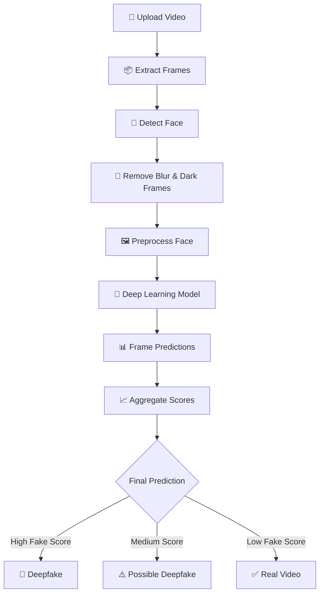
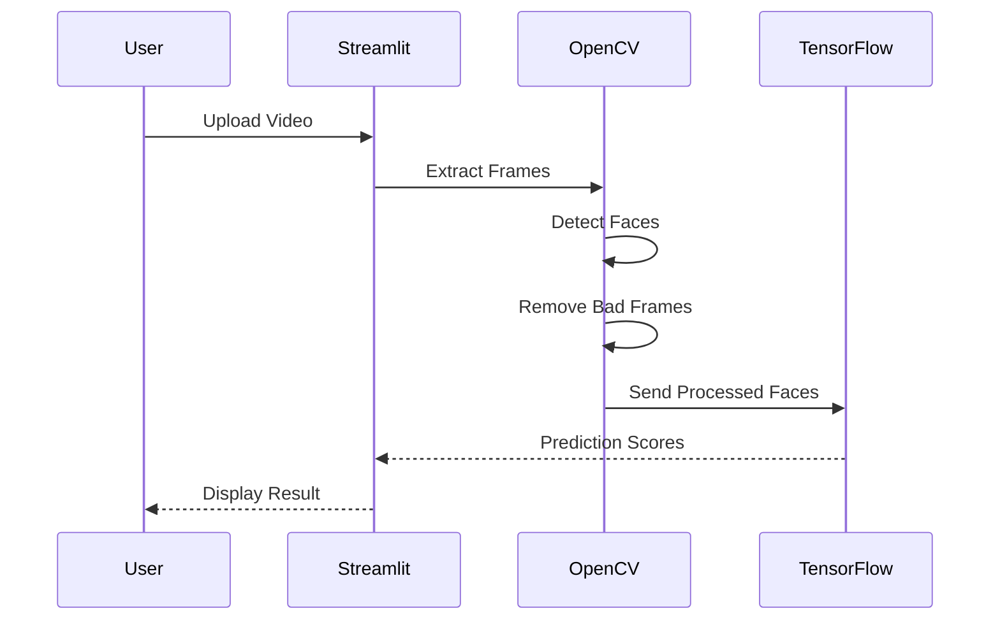
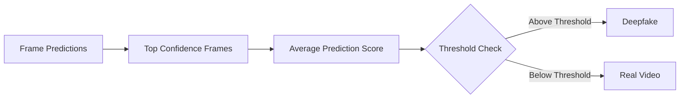

<div align="center">

# 🎥 Deepfake Video Detector

### AI-Powered Deepfake Detection using TensorFlow, OpenCV & Streamlit


<br>

<h3>🧠 Detect AI-generated fake videos using Deep Learning and Computer Vision</h3>

</div>

---

# 📌 Overview

Deepfake technology has evolved rapidly, making manipulated videos increasingly difficult to identify. This project provides an intelligent **Deepfake Video Detection System** that analyzes uploaded videos frame-by-frame using Deep Learning and Computer Vision techniques.

The application extracts faces from video frames, filters low-quality frames, processes them using a trained TensorFlow model, and predicts whether the uploaded video is:

- ✅ Real
- ⚠️ Possibly Deepfake
- 🚨 Deepfake

---

# ✨ Features

## 🎥 Video Processing
- Upload MP4, AVI, and MOV videos
- Automatic frame extraction
- Efficient frame sampling

## 👤 Face Detection
- YuNet ONNX face detector
- Accurate face cropping
- Optimized detection pipeline

## 🧹 Smart Frame Filtering
Removes:
- Blurry frames
- Dark frames
- Invalid detections

## 🧠 Deep Learning Detection
- TensorFlow/Keras based model
- Frame-level predictions
- Aggregated confidence scoring

## 🌐 Interactive UI
- Modern Streamlit interface
- Real-time predictions
- Simple and clean workflow

---

# 🏗️ System Architecture



---

# 🧠 Detection Workflow



---

# 📂 Project Structure

```bash
Deepfake-Video-Detector/
│
├── app.py
├── requirements.txt
├── README.md
├── face_detection_yunet_2023mar.onnx
│
├── model/
│   └── dfd_model.keras
│
├── assets/
│   ├── demo.png
│   └── architecture.png
│
└── notebooks/
    └── training.ipynb
```

---

# ⚙️ Tech Stack

| Technology | Purpose |
|---|---|
| Python | Core Programming |
| TensorFlow/Keras | Deep Learning |
| OpenCV | Computer Vision |
| Streamlit | Web Interface |
| NumPy | Numerical Processing |
| HuggingFace Hub | Model Hosting |

---

# 🚀 Installation

## 1️⃣ Clone Repository

```bash
git clone https://github.com/your-username/deepfake-video-detector.git

cd deepfake-video-detector
```

---

## 2️⃣ Install Dependencies

```bash
pip install -r requirements.txt
```

---

## 3️⃣ Download YuNet Face Detector

Download:
- `face_detection_yunet_2023mar.onnx`

From:
https://github.com/opencv/opencv_zoo

Place it in the project root directory.

---

## 4️⃣ Run Application

```bash
streamlit run app.py
```

---

# 📦 Requirements

```txt
streamlit
tensorflow
opencv-python
numpy
huggingface_hub
```

---

# 📸 Application Preview

<div align="center">

| Upload Interface | Detection Result |
|---|---|
|  |  |

</div>

---

# 🧠 Core Algorithms Used

## 👤 Face Detection
- YuNet ONNX Face Detector

## 🧠 Deepfake Classification
- CNN-based TensorFlow Model

## 🧹 Frame Quality Analysis
- Laplacian Blur Detection
- Brightness Thresholding

---

# 📊 Confidence Calculation



---

# 🌟 Future Improvements

- 🎙️ Audio Deepfake Detection
- 📱 Mobile App Integration
- ☁️ Cloud Deployment
- 🎥 Real-time Webcam Detection
- 🧠 Transformer-based Detection Models
- 📊 Explainable AI Visualizations

---

# 🔐 Challenges Solved

✅ Efficient frame sampling  
✅ False positive reduction  
✅ Blur filtering  
✅ Dark frame handling  
✅ Face extraction accuracy  
✅ Lightweight deployment  

---

# 📈 Performance Optimizations

| Optimization | Benefit |
|---|---|
| Frame Sampling | Faster Inference |
| Blur Detection | Better Accuracy |
| Brightness Filtering | Noise Reduction |
| Face Cropping | Focused Learning |

---

# 🌍 Real-World Applications

- 📰 Fake News Detection
- 🔐 Digital Media Verification
- 🛡️ Cybersecurity
- 🎥 Social Media Moderation
- ⚖️ Digital Forensics
- 👤 Identity Protection

---

# 👨‍💻 Author

## Atharva Mate

AI/ML Developer • Data Science Enthusiast • Computer Vision Explorer

---

# 🤝 Contributing

Contributions are welcome!

```bash
1. Fork the repository
2. Create a feature branch
3. Commit changes
4. Push branch
5. Open Pull Request
```

---

# 📜 License

This project is licensed under the MIT License.

---

# ⭐ Support

If you found this project useful:

⭐ Star the repository  
🍴 Fork the project  
🧠 Share with others  

---
